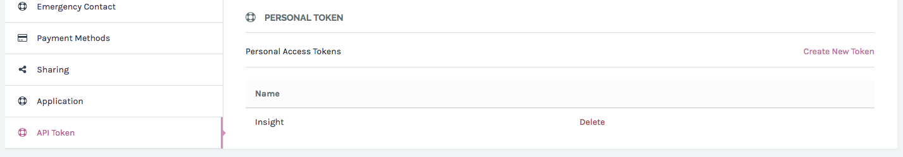
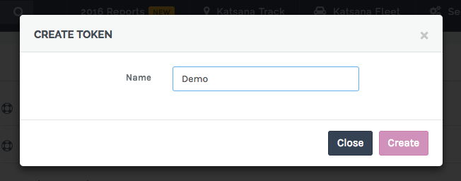
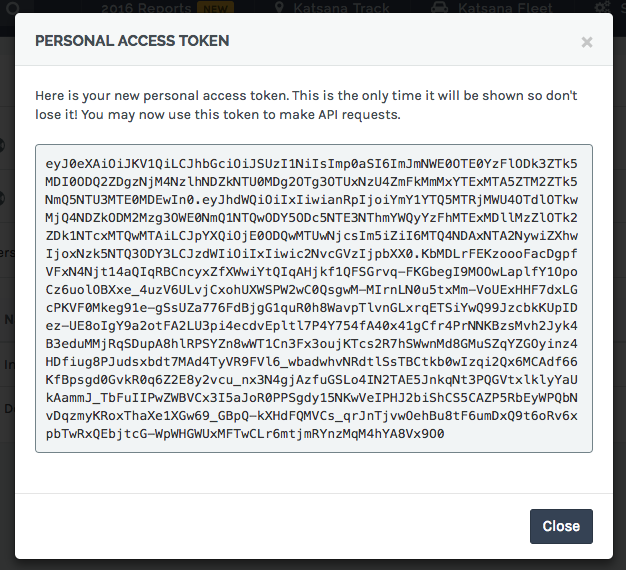

# KATSANA API Documentation

KATSANA API allows everyone to build apps on the KATSANA Platform. Our API is organized around REST. JSON will be returned in all responses from the API, including errors.

## Getting Started

Let's walk through core API concepts as we tackle some everyday use cases.

### API Information

To get started, you can first try out our default welcome API, which would return the current Platform version and list of supported API versions.

#### Request

    curl --request GET \
        --url https://api.katsana.com \
        --header 'accept: application/vnd.KATSANA.v1+json'
        
##### Headers

| Type          | Value                            | Required
|:--------------|:---------------------------------|:---------
| Accept        | application/vnd.KATSANA.v1+json  | Yes
| Authorization | Bearer {{access-token}}          | No
        
#### Response
  
    {
        "platform": "v4.3.9",
        "api": [
            "v1"
        ]
    }

### Personal Access Token

Each API developer should be able to generate Personal Access Token. From the top right menu on the Platform, click on **Account Settings**.

Next go to **API Token** sub-menu and click on **Create New Token**.

Type-in a name for the personal access token, add click **Create**.

Once generated, you're see a modal containing your access token.

> **WARNING:** Please copy this information to your application and on no condition share this key to anyone else.

### Data Format

#### Cheatsheet

| Type          | Format                            | Example
|:--------------|:----------------------------------|:---------
| Date          | `YYYY-MM-DD` (UTC timezone)       | `2016-12-31`
| Datetime      | `YYYY-MM-DD H:i:s` (UTC timezone) | `2016-12-31 14:31:21`
| Distance      | `metre`                           | `500`
| Duration      | `seconds`                         | `300`
| Ignition      | `true`, `false` or `null`         | `true`
| Odometer      | `kilometre`                        | `120450`
| Score         | `percentage`                      | `42`
| Speed         | `knot`                            | `60.47518`
| Voltage       | `milivolt`                        | `12436`

#### Date 

Date data will be returned using `YYYY-MM-DD` format (e.g: `2016-12-31`) using `UTC` timezone.

#### Datetime

Datetime data will be returned using `YYYY-MM-DD H:i:s` format (e.g: `2016-12-31 14:31:21`) using `UTC` format.

#### Distance

Distance data will be returned in `metre`.

#### Duration

Duration data will be return in `seconds`.

#### Ignition

Ignition value is either `true` when power is on, `false` when power is off and `null` if beacon is configured without ignition status.

#### Odometer

Odometer value will be returned in `kilometre`.

##### Score

Score value will be returned in `percentage`, between `0-100`. The higher the value, the better the score.

#### Speed

All speed data will be returned in `knot`.

#### Voltage

Voltage data will be returned using `milivolt`.

## Vehicles

Get vehicles informations.

### List Vehicles

List vehicle owned or viewable by the authenticated user.

#### API Endpoint

    GET /vehicles

##### Headers

| Type          | Value                            | Required
|:--------------|:---------------------------------|:---------
| Accept        | application/vnd.KATSANA.v1+json  | Yes
| Authorization | Bearer {{access-token}}          | Yes

#### Request

    curl --request GET \
        --url https://api.katsana.com/vehicles \
        --header 'accept: application/vnd.KATSANA.v1+json' \
        --header 'authorization: Bearer {{access-token}}'

#### Response

    {
        "devices": [
            {
                "id": 105,
                "user_id": 1,
                "imei": "356173063386671",
                "description": "Peugeot 308",
                "vehicle_number": "WXG 3365",
                "meta": {
                    "today": {
                        "date": "2017-01-09",
                        "max_speed": 60.47518
                    },
                    "latest": {
                        "latitude": 3.0088311,
                        "longitude": 101.5975165,
                        "speed": 0,
                        "state": "idle",
                        "ignition": false,
                        "voltage": 12485,
                        "gsm": 3,
                        "tracked_at": "2017-01-09 13:31:51"
                    },
                    "websocket": true
                },
                "current": {
                    "latitude": 3.0088311,
                    "longitude": 101.5975165,
                    "speed": 0,
                    "state": "idle",
                    "ignition": false,
                    "voltage": 12485,
                    "gsm": 3,
                    "tracked_at": "2017-01-09 13:31:51"
                },
                "avatar": "https://s3-ap-southeast-1.amazonaws.com/carbon.katsana/pictures/device-105/04375b22-d454-11e5-8724-f23c9126a0cc.thumb.png",
                "marker": "https://s3-ap-southeast-1.amazonaws.com/carbon.katsana/pictures/device-105/04375b22-d454-11e5-8724-f23c9126a0cc.marker.png",
                "today_max_speed": 60.47518,
                "odometer": 124277,
                "ends_at": "2020-08-30 16:00:00",
                "timezone": "Asia/Kuala_Lumpur"
            }
        ]
    }
    
### Show Single Vehicle

Show single vehicle owned or viewable by the authenticated user.

#### API Endpoint

    GET /vehicles/:id

> in this documentation we're using vehicle id `105` as an example.

##### Parameters

| Type          | Description          | Required
|:--------------|:---------------------|:---------
| `:id`         | Vehicle ID           | Yes

##### Headers

| Type          | Value                            | Required
|:--------------|:---------------------------------|:---------
| Accept        | application/vnd.KATSANA.v1+json  | Yes
| Authorization | Bearer {{access-token}}          | Yes

#### Request

    curl --request GET \
        --url https://api.katsana.com/vehicles/105 \
        --header 'accept: application/vnd.KATSANA.v1+json' \
        --header 'authorization: Bearer {{access-token}}'

#### Response

    {
        "device": {
            "id": 105,
            "user_id": 1,
            "imei": "356173063386671",
            "description": "Peugeot 308 Jejaka",
            "vehicle_number": "WXG 3365",
            "meta": {
                "today": {
                    "date": "2017-01-09",
                    "max_speed": 60.47518
                },
                "latest": {
                    "latitude": 3.0088311,
                    "longitude": 101.5975165,
                    "speed": 0,
                    "state": "idle",
                    "ignition": false,
                    "voltage": 12485,
                    "gsm": 3,
                    "tracked_at": "2017-01-09 13:31:51"
                },
                "websocket": true
            },
            "current": {
                "latitude": 3.0088311,
                "longitude": 101.5975165,
                "speed": 0,
                "state": "idle",
                "ignition": false,
                "voltage": 12485,
                "gsm": 3,
                "tracked_at": "2017-01-09 13:31:51"
            },
            "avatar": "https://s3-ap-southeast-1.amazonaws.com/carbon.katsana/pictures/device-105/04375b22-d454-11e5-8724-f23c9126a0cc.thumb.png",
            "marker": "https://s3-ap-southeast-1.amazonaws.com/carbon.katsana/pictures/device-105/04375b22-d454-11e5-8724-f23c9126a0cc.marker.png",
            "today_max_speed": 60.47518,
            "odometer": 124277,
            "ends_at": "2020-08-30 16:00:00",
            "timezone": "Asia/Kuala_Lumpur"
        }
    }
    
## Vehicles Location

Get current location for a vehicle.

#### API Endpoint

    GET /vehicles/:id/location

> in this documentation we're using vehicle id `105` as an example.

##### Parameters

| Type          | Description          | Required
|:--------------|:---------------------|:---------
| `:id`         | Vehicle ID           | Yes

##### Headers

| Type          | Value                            | Required
|:--------------|:---------------------------------|:---------
| Accept        | application/vnd.KATSANA.v1+json  | Yes
| Authorization | Bearer {{access-token}}          | Yes

#### Request

    curl --request GET \
        --url https://api.katsana.com/vehicles/105/location \
        --header 'accept: application/vnd.KATSANA.v1+json' \
        --header 'authorization: Bearer {{access-token}}'

#### Response

    {
        "id": 105,
        "latitude": 3.0088311,
        "longitude": 101.5975165,
        "speed": 0,
        "state": "idle",
        "ignition": false,
        "voltage": 12485,
        "gsm": 3,
        "tracked_at": "2017-01-09 13:31:51"
    }

## Vehicles Summaries

Get vehicles travel summaries.

### Today Summary

#### API Endpoint

    GET /vehicles/:id/summaries/today

> in this documentation we're using vehicle id `105` as an example.

##### Parameters

| Type          | Description          | Required
|:--------------|:---------------------|:---------
| `:id`         | Vehicle ID           | Yes

##### Headers

| Type          | Value                            | Required
|:--------------|:---------------------------------|:---------
| Accept        | application/vnd.KATSANA.v1+json  | Yes
| Authorization | Bearer {{access-token}}          | Yes

#### Request

    curl --request GET \
        --url https://api.katsana.com/vehicles/105/summaries/today \
        --header 'accept: application/vnd.KATSANA.v1+json' \
        --header 'authorization: Bearer {{access-token}}'

#### Response

    {
        "date": "2017-01-10",
        "distance": 12748,
        "duration": 2302,
        "idle_duration": 113,
        "max_speed": 40,
        "trip": 2,
        "violation": 0
    }
    
### Yesterday Summary

#### API Endpoint

    GET /vehicles/:id/summaries/yesterday

> in this documentation we're using vehicle id `105` as an example.

##### Parameters

| Type          | Description          | Required
|:--------------|:---------------------|:---------
| `:id`         | Vehicle ID           | Yes

##### Headers

| Type          | Value                            | Required
|:--------------|:---------------------------------|:---------
| Accept        | application/vnd.KATSANA.v1+json  | Yes

#### Request

    curl --request GET \
        --url https://api.katsana.com/vehicles/105/summaries/yesterday \
        --header 'accept: application/vnd.KATSANA.v1+json' \
        --header 'authorization: Bearer {{access-token}}'
        
#### Response

    {
        "date": "2017-01-09",
        "distance": 75033,
        "duration": 10430,
        "idle_duration": 234,
        "max_speed": 60,
        "trip": 5,
        "violation": 0
    }
   
### Summary by Date

#### API Endpoint

    GET /vehicles/:id/summaries/:year/:month/:day

> in this documentation we're using vehicle id `105` as an example.

##### Parameters

| Type          | Description          | Required
|:--------------|:---------------------|:---------
| `:id`         | Vehicle ID           | Yes
| `:year`       | Year                 | Yes
| `:month`      | Month                | Yes
| `:day`        | Day                  | Yes

##### Headers

| Type          | Value                            | Required
|:--------------|:---------------------------------|:---------
| Accept        | application/vnd.KATSANA.v1+json  | Yes
| Authorization | Bearer {{access-token}}          | Yes

#### Request

    curl --request GET \
        --url https://api.katsana.com/vehicles/105/summaries/2017/01/01 \
        --header 'accept: application/vnd.KATSANA.v1+json' \
        --header 'authorization: Bearer {{access-token}}'

#### Response

    {
        "date": "2017-01-01",
        "distance": 29260,
        "duration": 3025,
        "idle_duration": 182,
        "max_speed": 58,
        "trip": 4,
        "violation": 0
    }
   
### Summary by Duration

#### API Endpoint

    GET /vehicles/:id/summaries/duration?start&end
    
> in this documentation we're using vehicle id `105` as an example.

##### Parameters

| Type          | Description          | Required
|:--------------|:---------------------|:---------
| `:id`         | Vehicle ID           | Yes

##### Query String

| Type          | Description          | Required
|:--------------|:---------------------|:---------
| `start`       | Start date           | Yes
| `end`         | End date             | Yes

##### Headers

| Type          | Value                            | Required
|:--------------|:---------------------------------|:---------
| Accept        | application/vnd.KATSANA.v1+json  | Yes
| Authorization | Bearer {{access-token}}          | Yes

#### Request

    curl --request GET \
        --url https://api.katsana.com/vehicles/105/summaries/duration?start=2017-01-01&end=2017-01-03 \
        --header 'accept: application/vnd.KATSANA.v1+json' \
        --header 'authorization: Bearer {{access-token}}'

#### Response

    [
        {
            "date": "2017-01-01",
            "distance": 29260,
            "duration": 3025,
            "idle_duration": 182,
            "max_speed": 58,
            "trip": 4,
            "violation": 0
        },
        {
            "date": "2017-01-02",
            "distance": 34930,
            "duration": 5154,
            "idle_duration": 163,
            "max_speed": 56,
            "trip": 8,
            "violation": 0
        },
        {
            "date": "2017-01-03",
            "distance": 44336,
            "duration": 6988,
            "idle_duration": 0,
            "max_speed": 43,
            "trip": 9,
            "violation": 0
        }
    ]

### Summary by Month

#### API Endpoint

    GET /vehicles/:id/summaries/:year/:month
    
> in this documentation we're using vehicle id `105` as an example.

##### Parameters

| Type          | Description          | Required
|:--------------|:---------------------|:---------
| `:id`         | Vehicle ID           | Yes
| `:year`       | Year                 | Yes
| `:month`      | Month                | Yes

##### Headers

| Type          | Value                            | Required
|:--------------|:---------------------------------|:---------
| Accept        | application/vnd.KATSANA.v1+json  | Yes
| Authorization | Bearer {{access-token}}          | Yes

#### Request

    curl --request GET \
        --url https://api.katsana.com/vehicles/105/summaries/2017/01 \
        --header 'accept: application/vnd.KATSANA.v1+json' \
        --header 'authorization: Bearer {{access-token}}'

#### Response

    [
        {
            "date": "2017-01-01",
            "distance": 29260,
            "duration": 3025,
            "idle_duration": 182,
            "max_speed": 58,
            "trip": 4,
            "violation": 0
        },
        {
            "date": "2017-01-02",
            "distance": 34930,
            "duration": 5154,
            "idle_duration": 163,
            "max_speed": 56,
            "trip": 8,
            "violation": 0
        },
        {
            "date": "2017-01-03",
            "distance": 44336,
            "duration": 6988,
            "idle_duration": 0,
            "max_speed": 43,
            "trip": 9,
            "violation": 0
        },
        
        // ....
    ]
    
## Vehicles Travels

### Today Travel

#### API Endpoint

    GET /vehicles/:id/travels/today
    
> in this documentation we're using vehicle id `105` as an example.

##### Parameters

| Type          | Description          | Required
|:--------------|:---------------------|:---------
| `:id`         | Vehicle ID           | Yes

##### Headers

| Type          | Value                            | Required
|:--------------|:---------------------------------|:---------
| Accept        | application/vnd.KATSANA.v1+json  | Yes
| Authorization | Bearer {{access-token}}          | Yes

##### Request

    curl --request GET \
        --url https://api.katsana.com/vehicles/105/travels/today \
        --header 'accept: application/vnd.KATSANA.v1+json' \
        --header 'authorization: Bearer {{access-token}}'
        
#### Response

    {
        "trips": [
            {
                "start": {
                    "id": 200811,
                    "latitude": 3.0089671,
                    "longitude": 101.5974525,
                    "tracked_at": "2017-01-09 23:15:15"
                },
                "end": {
                    "id": 200973,
                    "latitude": 3.0096175,
                    "longitude": 101.598688,
                    "tracked_at": "2017-01-09 23:49:07"
                },
                "distance": 12230,
                "duration": 2032,
                "max_speed": 40.496773,
                "average_speed": 10.918302722759,
                "idle_duration": 113,
                "score": 100,
                "idles": [
                    {
                        "id": 200812,
                        "latitude": 3.0089671,
                        "longitude": 101.5974525,
                        "tracked_at": "2017-01-09 23:15:35"
                    }
                ],
                "histories": [
                    {
                        "id": 200818,
                        "latitude": 3.0091215,
                        "longitude": 101.597612,
                        "speed": 3.7796988,
                        "tracked_at": "2017-01-09 23:17:28"
                    },
                    {
                        "id": 200819,
                        "latitude": 3.0091401,
                        "longitude": 101.5976141,
                        "speed": 3.2397418,
                        "tracked_at": "2017-01-09 23:17:29"
                    },
                    {
                        "id": 200820,
                        "latitude": 3.00913,
                        "longitude": 101.5976488,
                        "speed": 7.0194407,
                        "tracked_at": "2017-01-09 23:17:39"
                    },
                    // ...
                ],
                "violations": []
            },
            {
                "start": {
                    "id": 200975,
                    "latitude": 3.0096219,
                    "longitude": 101.5986685,
                    "tracked_at": "2017-01-09 23:53:10"
                },
                "end": {
                    "id": 201002,
                    "latitude": 3.0090326,
                    "longitude": 101.597272,
                    "tracked_at": "2017-01-09 23:57:40"
                },
                "distance": 516,
                "duration": 270,
                "max_speed": 13.498924,
                "average_speed": 7.1737142142857,
                "idle_duration": 0,
                "score": 100,
                "idles": [],
                "histories": [
                    {
                        "id": 200977,
                        "latitude": 3.0096348,
                        "longitude": 101.5986675,
                        "speed": 3.7796988,
                        "tracked_at": "2017-01-09 23:53:33"
                    },
                    {
                        "id": 200978,
                        "latitude": 3.0096513,
                        "longitude": 101.5986498,
                        "speed": 4.859613,
                        "tracked_at": "2017-01-09 23:53:34"
                    },
                    {
                        "id": 200979,
                        "latitude": 3.0096923,
                        "longitude": 101.5985031,
                        "speed": 5.939527,
                        "tracked_at": "2017-01-09 23:53:39"
                    },
                    // ...
                ],
                "violations": []
            }
        ],
        "summary": {
            "max_speed": 40.496773,
            "distance": 12748,
            "violation": 0
        },
        "duration": {
            "from": "2017-01-09 16:00:00",
            "to": "2017-01-10 15:59:59"
        }
    }

### Yesterday Travel

#### API Endpoint

    GET /vehicles/:id/travels/yesterday
    
> in this documentation we're using vehicle id `105` as an example.

##### Parameters

| Type          | Description          | Required
|:--------------|:---------------------|:---------
| `:id`         | Vehicle ID           | Yes

##### Headers

| Type          | Value                            | Required
|:--------------|:---------------------------------|:---------
| Accept        | application/vnd.KATSANA.v1+json  | Yes
| Authorization | Bearer {{access-token}}          | Yes

##### Request

    curl --request GET \
        --url https://api.katsana.com/vehicles/105/travels/yesterday \
        --header 'accept: application/vnd.KATSANA.v1+json' \
        --header 'authorization: Bearer {{access-token}}'
        
#### Response

    {
        "trips": [
            {
                "start": {
                    "id": 200811,
                    "latitude": 3.0089671,
                    "longitude": 101.5974525,
                    "tracked_at": "2017-01-09 23:15:15"
                },
                "end": {
                    "id": 200973,
                    "latitude": 3.0096175,
                    "longitude": 101.598688,
                    "tracked_at": "2017-01-09 23:49:07"
                },
                "distance": 12230,
                "duration": 2032,
                "max_speed": 40.496773,
                "average_speed": 10.918302722759,
                "idle_duration": 113,
                "score": 100,
                "idles": [
                    {
                        "id": 200812,
                        "latitude": 3.0089671,
                        "longitude": 101.5974525,
                        "tracked_at": "2017-01-09 23:15:35"
                    }
                ],
                "histories": [
                    {
                        "id": 200818,
                        "latitude": 3.0091215,
                        "longitude": 101.597612,
                        "speed": 3.7796988,
                        "tracked_at": "2017-01-09 23:17:28"
                    },
                    {
                        "id": 200819,
                        "latitude": 3.0091401,
                        "longitude": 101.5976141,
                        "speed": 3.2397418,
                        "tracked_at": "2017-01-09 23:17:29"
                    },
                    {
                        "id": 200820,
                        "latitude": 3.00913,
                        "longitude": 101.5976488,
                        "speed": 7.0194407,
                        "tracked_at": "2017-01-09 23:17:39"
                    },
                    // ...
                ],
                "violations": []
            },
            {
                "start": {
                    "id": 200975,
                    "latitude": 3.0096219,
                    "longitude": 101.5986685,
                    "tracked_at": "2017-01-09 23:53:10"
                },
                "end": {
                    "id": 201002,
                    "latitude": 3.0090326,
                    "longitude": 101.597272,
                    "tracked_at": "2017-01-09 23:57:40"
                },
                "distance": 516,
                "duration": 270,
                "max_speed": 13.498924,
                "average_speed": 7.1737142142857,
                "idle_duration": 0,
                "score": 100,
                "idles": [],
                "histories": [
                    {
                        "id": 200977,
                        "latitude": 3.0096348,
                        "longitude": 101.5986675,
                        "speed": 3.7796988,
                        "tracked_at": "2017-01-09 23:53:33"
                    },
                    {
                        "id": 200978,
                        "latitude": 3.0096513,
                        "longitude": 101.5986498,
                        "speed": 4.859613,
                        "tracked_at": "2017-01-09 23:53:34"
                    },
                    {
                        "id": 200979,
                        "latitude": 3.0096923,
                        "longitude": 101.5985031,
                        "speed": 5.939527,
                        "tracked_at": "2017-01-09 23:53:39"
                    },
                    // ...
                ],
                "violations": []
            }
        ],
        "summary": {
            "max_speed": 40.496773,
            "distance": 12748,
            "violation": 0
        },
        "duration": {
            "from": "2017-01-09 16:00:00",
            "to": "2017-01-10 15:59:59"
        }
    }

### Travel by Date

#### API Endpoint

    GET /vehicles/:id/travels/:year/:month/:day
    
> in this documentation we're using vehicle id `105` as an example.

##### Parameters

| Type          | Description          | Required
|:--------------|:---------------------|:---------
| `:id`         | Vehicle ID           | Yes
| `:year`       | Year                 | Yes
| `:month`      | Month                | Yes
| `:day`        | Day                  | Yes

##### Headers

| Type          | Value                            | Required
|:--------------|:---------------------------------|:---------
| Accept        | application/vnd.KATSANA.v1+json  | Yes
| Authorization | Bearer {{access-token}}          | Yes

##### Request

    curl --request GET \
        --url https://api.katsana.com/vehicles/105/travels/2017/01/10 \
        --header 'accept: application/vnd.KATSANA.v1+json' \
        --header 'authorization: Bearer {{access-token}}'
        
#### Response

    {
        "trips": [
            {
                "start": {
                    "id": 200811,
                    "latitude": 3.0089671,
                    "longitude": 101.5974525,
                    "tracked_at": "2017-01-09 23:15:15"
                },
                "end": {
                    "id": 200973,
                    "latitude": 3.0096175,
                    "longitude": 101.598688,
                    "tracked_at": "2017-01-09 23:49:07"
                },
                "distance": 12230,
                "duration": 2032,
                "max_speed": 40.496773,
                "average_speed": 10.918302722759,
                "idle_duration": 113,
                "score": 100,
                "idles": [
                    {
                        "id": 200812,
                        "latitude": 3.0089671,
                        "longitude": 101.5974525,
                        "tracked_at": "2017-01-09 23:15:35"
                    }
                ],
                "histories": [
                    {
                        "id": 200818,
                        "latitude": 3.0091215,
                        "longitude": 101.597612,
                        "speed": 3.7796988,
                        "tracked_at": "2017-01-09 23:17:28"
                    },
                    {
                        "id": 200819,
                        "latitude": 3.0091401,
                        "longitude": 101.5976141,
                        "speed": 3.2397418,
                        "tracked_at": "2017-01-09 23:17:29"
                    },
                    {
                        "id": 200820,
                        "latitude": 3.00913,
                        "longitude": 101.5976488,
                        "speed": 7.0194407,
                        "tracked_at": "2017-01-09 23:17:39"
                    },
                    // ...
                ],
                "violations": []
            },
            {
                "start": {
                    "id": 200975,
                    "latitude": 3.0096219,
                    "longitude": 101.5986685,
                    "tracked_at": "2017-01-09 23:53:10"
                },
                "end": {
                    "id": 201002,
                    "latitude": 3.0090326,
                    "longitude": 101.597272,
                    "tracked_at": "2017-01-09 23:57:40"
                },
                "distance": 516,
                "duration": 270,
                "max_speed": 13.498924,
                "average_speed": 7.1737142142857,
                "idle_duration": 0,
                "score": 100,
                "idles": [],
                "histories": [
                    {
                        "id": 200977,
                        "latitude": 3.0096348,
                        "longitude": 101.5986675,
                        "speed": 3.7796988,
                        "tracked_at": "2017-01-09 23:53:33"
                    },
                    {
                        "id": 200978,
                        "latitude": 3.0096513,
                        "longitude": 101.5986498,
                        "speed": 4.859613,
                        "tracked_at": "2017-01-09 23:53:34"
                    },
                    {
                        "id": 200979,
                        "latitude": 3.0096923,
                        "longitude": 101.5985031,
                        "speed": 5.939527,
                        "tracked_at": "2017-01-09 23:53:39"
                    },
                    // ...
                ],
                "violations": []
            }
        ],
        "summary": {
            "max_speed": 40.496773,
            "distance": 12748,
            "violation": 0
        },
        "duration": {
            "from": "2017-01-09 16:00:00",
            "to": "2017-01-10 15:59:59"
        }
    }
